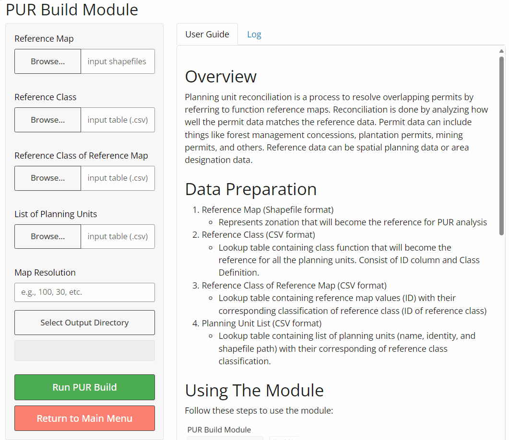

# Overview

Planning unit reconciliation is a process to resolve overlapping permits by referring to function reference maps. Permit data can include things like forest management concessions, plantation permits, mining permits, and others. Reference data can be spatial planning data or area designation data. PUR Build module construct the overlay of planning units map to identified the overlaped zones. 

# Data and Input Variables

1.  Reference Map (Shapefile format)
    -   Represents zonation that will become the reference for PUR analysis
2.  Reference Class (CSV format)
    -   Lookup table containing class function that will become the reference for all the planning units. Consist of ID column and Class Definition.
3.  Reference Class of Reference Map (CSV format)
    -   Lookup table containing reference map values (ID) with their corresponding classification of reference class (ID of reference class)
4.  Planning Unit List (CSV format)
    -   Lookup table containing list of planning units (name, identity, and shapefile path) with their corresponding of reference class classification.

# Using The Module

Follow these steps to use the module:

{style="max-width:80%; height:auto;"}

# Accessing Outputs

After the analysis completes, you'll find the following output data in your selected output directory:

-   Built Planning Unit Map (Shapefile & GeoTiff)

-   Reconciliation Table (CSV)

-   **PUR Build Report**: An HTML file providing an overview of the analysis results, including:

    -   Data visualisation on input data
    -   Data visualisation on planning unit building
    -   Descriptive statistics of planning unit and unresolved cases

------------------------------------------------------------------------

For more detailed information or troubleshooting, refer to the full QuES-H documentation or contact the tool developers.

LUMENS is free software and comes with ABSOLUTELY NO WARRANTY. Users are responsible for the results generated. Results depend on the quality of the input data ("garbage in, garbage out") and may vary or be sensitive to the parameters used. Please report any problems encountered while using LUMENS as [a GitHub issue](https://github.com/icraf-indonesia/lumens-shiny/issues). Feedback and questions are welcome [Contact Us URL].
