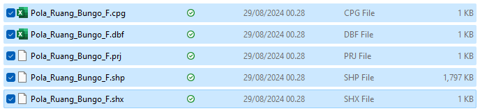
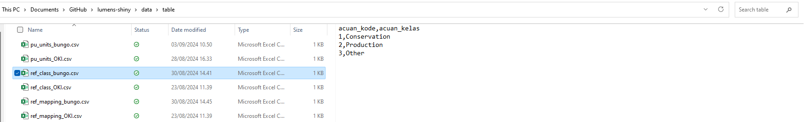
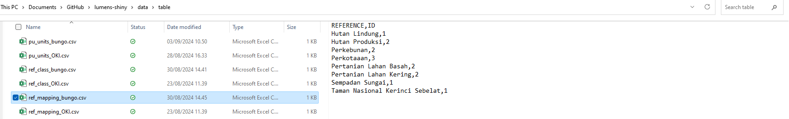
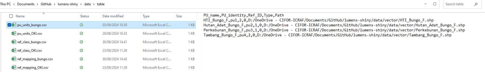
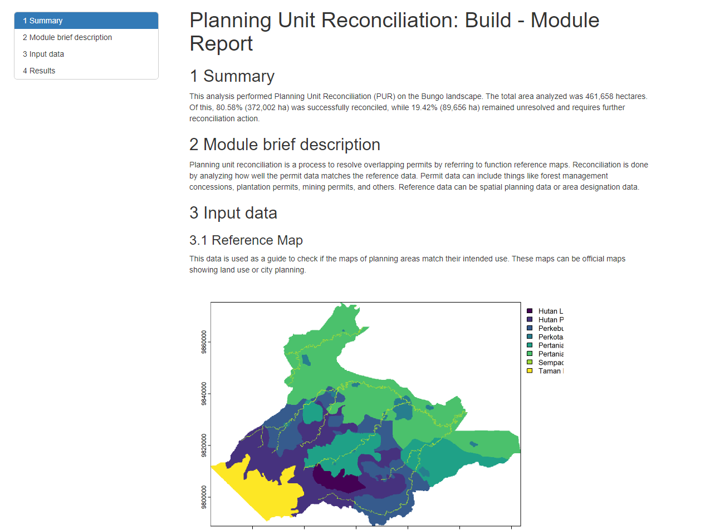

## Help Page for PUR Build Module

## 1. Description

Planning unit reconciliation is a process to resolve overlapping permits by referring to function reference maps. Reconciliation is done by analyzing how well the permit data matches the reference data. Permit data can include things like forest management concessions, plantation permits, mining permits, and others. Reference data can be spatial planning data or area designation data.

## 2. Required Data

## 3. Running Model

### 3.1 Input data

#### Shapefile data (select all related shapefile):

#### Tabular data:

-   reference class 
-   reference class of reference map 
-   planning unit list 

#### Map resolution

Default value: 100

### 3.2 Set working directory

### 3.3 Run the module

## 4. Output

### 4.1 Exported data

### 4.2 Report file

