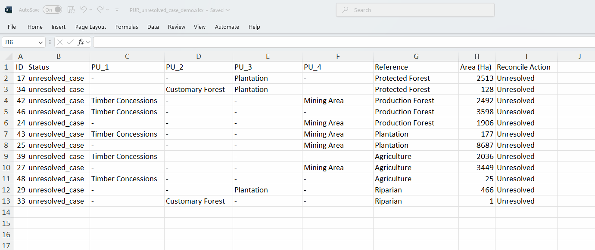
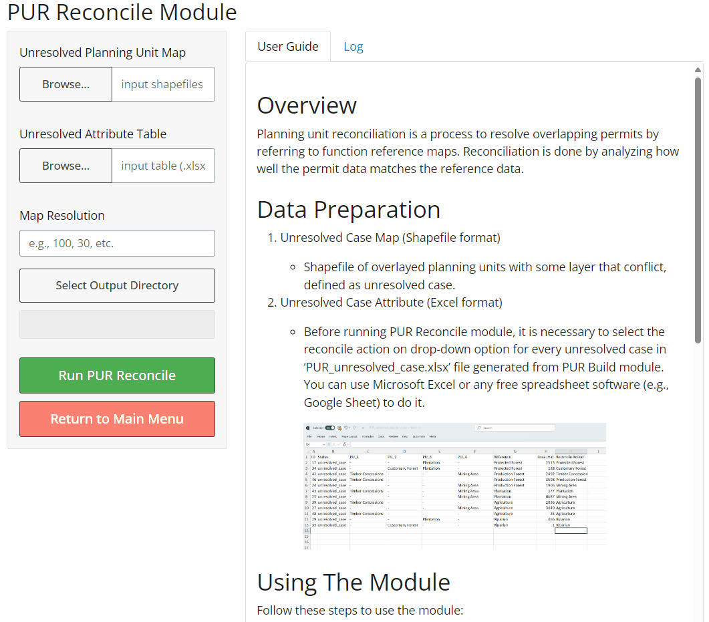

# Overview

Planning unit reconciliation is a process to resolve overlapping permits by referring to function reference maps. Reconciliation is done by analyzing how well the permit data matches the reference data.

# Data and Input Variables

1.  Unresolved Case Map (Shapefile format)

    -   Shapefile of overlayed planning units with some layer that conflict, defined as unresolved case.

2.  Unresolved Case Attribute (Excel format)

    -   Before running PUR Reconcile module, it is necessary to select the reconcile action on drop-down option for every unresolved case in 'PUR_reconciliation_table.xlsx' file generated from PUR Build module. You can use Microsoft Excel or any free spreadsheet software (e.g., Google Sheet) to do it.

        {style="max-width:80%; height:auto;"}

# Using The Module

Follow these steps to use the module:

{style="max-width:80%; height:auto;"}

# Accessing Outputs

After the analysis completes, you'll find the following output data in your selected output directory:

-   Planning Unit Reconcile (shapefile and raster)

-   Reconciled Class Attribute Result (CSV)

-   **PUR Reconcile Report**: An HTML file providing an overview of the analysis results, including:

    -   Data visualisation on input data
    -   Data visualisation on planning unit reconciliation result
    -   Descriptive statistics resolved case of planning units

------------------------------------------------------------------------

For more detailed information or troubleshooting, refer to the full QuES-H documentation or contact the tool developers.

LUMENS is free software and comes with ABSOLUTELY NO WARRANTY. Users are responsible for the results generated. Results depend on the quality of the input data ("garbage in, garbage out") and may vary or be sensitive to the parameters used. Please report any problems encountered while using LUMENS as [a GitHub issue](https://github.com/icraf-indonesia/lumens-shiny/issues). Feedback and questions are welcome [Contact Us URL].
