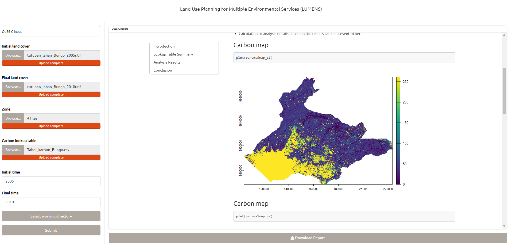

# Tutorial LUMENS - QuES-C

This is a prototype

## All QUES-C Inputs

{width="206"}

## Upload shapefiles

Select all related shp

{width="561"}

## Select working directory

{width="575"}

## Prototype v1.0.0

