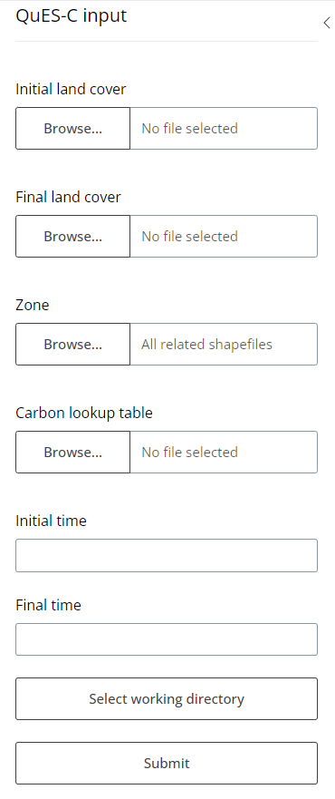
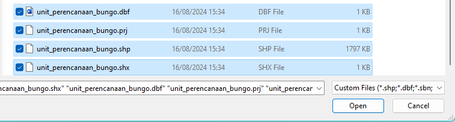
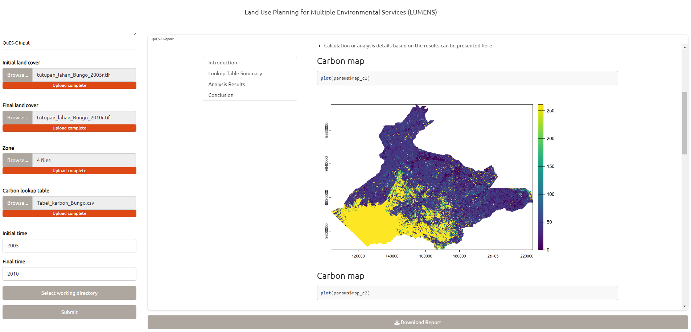

# Tutorial LUMENS - QuES-C

## Table of Contents

[1. Brief description of QuES-C modelling principles](#_toc_description)

[2. Preparing inputs for model simulation](#_toc_inputs)

[3. How to run the model](#_toc_run)

[4. Outputs of the model](#_toc_outputs)

[5. Useful references](#_toc_refs)

[Annex 1 Complete list of inputs and parameters required by QuES-C](#_toc_annex)

------------------------------------------------------------------------

## 1. Brief description of QuES-C Abacus modelling principles

QuES-C is a sub-module of LUMENS

## 2. Preparing inputs for model simulation

## 3. How to run the model

### Upload shapefiles

Select all related shp

### Select working directory

## 4. Outputs of the model

## 5. Useful references

## Annex 1 Complete list of inputs and parameters required by QuES-C

