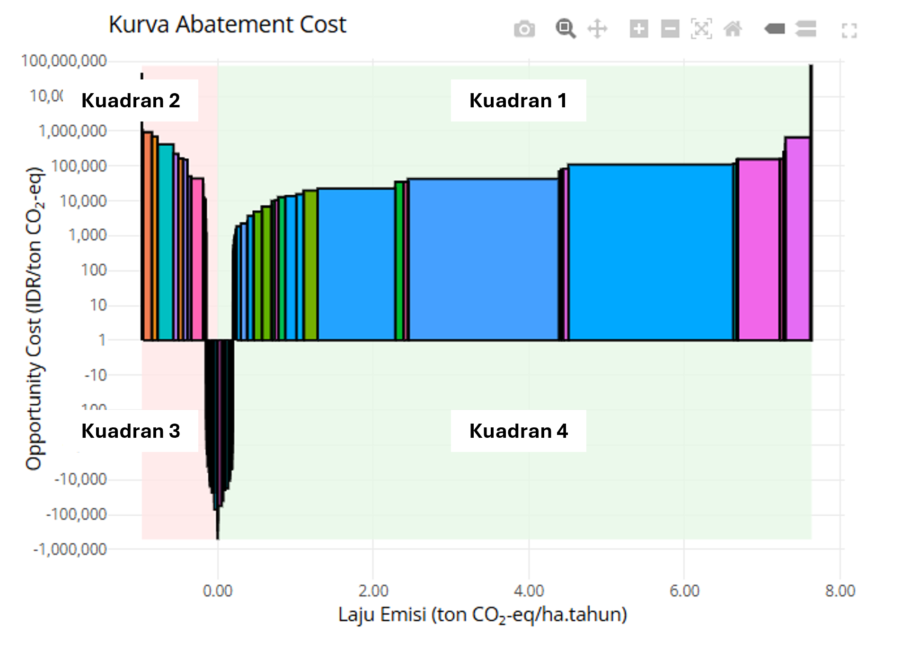

```{r setup, include=FALSE}
knitr::opts_chunk$set(echo = FALSE)
library(knitr)
library(kableExtra)
library(tidyr)
library(pkgdown)
library(ggplot2)
library(htmlwidgets)
library(DT)
library(scales)
library(leaflet)
library(mapview)
library(dplyr)
library(LUMENSR)
library(glue)
```

<details><summary>Klik di sini untuk Log Analisis</summary>

```{r analysis-log, echo=FALSE}

analysis_log <- tribble(
  ~Category,                   ~Details,
  "Analysis Start",        params$start_time,
  "Analysis End",          params$end_time,
  "Input Data and Parameters", "",
  "Land Cover (t1)",      params$map1_file_path,
  "Land Cover (t2)",   params$map2_file_path,
  "Profitability data",   params$npv_file_path,
  "Year of Profitability table", as.character(params$eae_year),
  "Planning Unit map",   params$pu_file_path,
  "Planning Unit data",   params$pu_table_path,
  "Year 1", as.character(params$year1),
  "Year 2", as.character(params$year2),
  "NoData land-cover class", as.character(params$raster_nodata),
  "Output Files", "",
  "Output Workspace",      paste0(getwd(), " | ", params$output_dir),
  "Session Summary", "",
) %>% rbind(format_session_info_table())

analysis_log %>% kbl(caption = "Analysis Log", escape = FALSE) %>%
  kable_paper("hover", full_width = F )
```
</details>

# Pendahuluan

## Deskripsi Modul
Laporan ini menyajikan hasil Analisis Profitabilitas berdasarkan skenario perubahan penggunaan lahan. Analisis berfokus pada penilaian keuntungan finansial atau profitabilitas dari setiap tutupan lahan. Pendekatan ini membantu mengevaluasi implikasi keuangan dari transisi penggunaan lahan berdasarkan manfaat bersih tahunan serta mendukung pengambilan keputusan yang terinformasi untuk menilai kelayakan ekonomi berbagai skenario penggunaan lahan.

### Indikator Keuntungan

Indikator ekonomi yang digunakan adalah Nilai Tahunan Ekuivalen atau Equal Annual Equivalent (EAE). EAE Adalah nilai tahunan yang setara dari Net Present Value (NPV) suatu tutupan lahan per satuan luas lahan. EAE mengubah seluruh nilai keuntungan bersih suatu tutupan lahan yang dihitung dalam bentuk NPV menjadi nilai rata-rata keuntungan tahunan yang ekuivalen yang telah terdiskonto. Indikator EAE digunakan untuk mengakomodir kemungkinan perbedaan siklus hidup tanaman di suatu tutupan lahan,  dengan rumus sebagai berikut:

$$
EAE = NPV \times \frac{i(1+i)^t}{(1+i)^t - 1}
$$
Keterangan:

- $EAE$ = Equal Annual Equivalent (nilai tahunan ekuivalen)
- $NPV$ = Net Present Value (nilai kini bersih)
- $i$ = Tingkat suku bunga riil (faktor diskonto)
- $t$ = Tahun ke-1, 2, 3, ..., $n$ selama periode analisis

Sedangkan Net Present Value (NPV) merupakan keuntungan atau pendapatan bersih saat ini yang didapat dari selisih antara penerimaan dengan biaya selama periode tertentu. NPV adalah penerimaan yang terdiskonto, dalam perhitungannya menggunakan faktor diskonto karena menormalkan nilai keuntungan di masa depan ke masa kini. Suatu kegiatan dikatakan memiliki manfaat dan layak dijalankan bila NPV > 0. Rumus NPV adalah:  

$$
NPV = \sum_{t=0}^{n}
\frac{B_t - C_t}{(1+i)^t}
$$
Keterangan:

- $B_t$ = Manfaat atau penerimaan pada tahun ke-$t$
- $C_t$ = Biaya pada tahun ke-$t$
- $t$ = Tahun ke-1, 2, 3, ..., $n$ selama periode analisis
- $i$ = Tingkat suku bunga riil (faktor diskonto)

Tingkat diskonto (discount factor) menggunakan tingkat suku bunga riil, dengan rumusan sebagai berikut:

$$
i = \frac{1 + \text{Nominal Interest Rate}}
{1 + \text{Inflation Rate}} - 1
$$

Nominal interest rate yang digunakan adalah suku bunga kredit bank umum untuk modal kerja, sedangkan inflation rate adalah tingkat inflasi tahunan. Asumsi harga input-output, suku bunga riil, dan tingkat inflasi tahunan yang digunakan adalah nilai dari tahun `r params$eae_year` baik untuk perhitungan T1 `r params$year1` maupun T2 `r params$year2`.

### Abatement Cost

Abatement cost adalah biaya yang harus dikeluarkan untuk mengurangi (meng-abate) satu unit emisi gas rumah kaca dibandingkan kondisi dasar (baseline).
Dalam konteks ekonomi lingkungan dan perubahan penggunaan lahan, abatement cost sering digunakan untuk menghitung:

•	biaya pengurangan emisi, 

•	trade-off antara keuntungan ekonomi dan penurunan emisi, 

Kurva biaya pengurangan emisi (abatement cost) menunjukkan perbandingan biaya peluang dari berbagai jenis perubahan penggunaan lahan dalam `r params$currency` per ton CO₂-eq dan menunjukkan kuantitas potensi pengurangan emisi per jenis perubahan penggunaan lahan, satuan yang digunakan adalah `r params$currency`/ton CO₂-eq. Kurva biaya pengurangan emisi (abatement cost) tidak menentukan siapa yang harus dibayar, tetapi memberikan perkiraan biaya peluang rata-rata dan marginal dari pengurangan emisi. Rumus untuk menghitung biaya peluang dalam `r params$currency`/ton CO₂-eq adalah:

$$
\frac{EAE_{T2} - EAE_{T1}}
{3.67 \left( C_{stok,T1} - C_{stok,T2} \right)}
=
\frac{\text{Opportunity Cost}}
{\text{Additional Carbon Stock}}
$$
Keterangan:

- $EAE_{T2}$ = Equal Annual Equivalent pada tutupan lahan T2
- $EAE_{T1}$ = Equal Annual Equivalent pada tutupan lahan T1
- $C_{stok,T1}$ = Stok karbon pada tutupan lahan T1
- $C_{stok,T2}$ = Stok karbon pada tutupan lahan T2

Berikut contoh grafik abatement cost yang memiliki 4 kuadran:



Sumbu X adalah abatement potential (ton CO₂-eq/tahun), dan sumbu Y adalah besarnya potensi pengurangan emisi per tahun (Semakin lebar balok, menandakan semakin besar kontribusi penurunan emisinya). Terdapat 4 kondisi yang akan disertakan contoh kasus untuk kempat hal ini:

1. Nilai abatement cost positif dan abatement potential positif: Kuadran 1

Kondisi yang memerlukan trade off analysis karena semakin tinggi abatement cost maka semakin kurang visible untuk project carbon, jika semakin rendah abatement cost maka semakin visible untuk suatu project carbon. 

2. Nilai abatement cost positif dan abatement potential negatif: Kuadran 2

Kondisi sequestrasi untuk carbon.

3. Nilai abatement cost negatif dan abatement potential positif: Kuadran 3

Sistem yang ditawarkan lebih menguntungkan sekaligus meningkatkan stok karbon atau dalam kata lain pengurangan emisi menghasilkan keuntungan ekonomi tambahan dimana ini adalah kondisi win-win scenario atau no regret mitigation sehingga tidak perlu ada trade off analysis.

4. Nilai abatement cost negatif dan abatement potential negatif: Kuadran 4

Sistem yang ditawarkan menawarkan ekonomi membaik tetapi lingkungan memburuk.

## Cara Kerja Analisis
Alur kerja analisis melibatkan beberapa langkah kunci:

1. **Pemrosesan Data EAE**: Data EAE diproses untuk membuat tabel referensi yang komprehensif.

2. **Analisis Perubahan Penggunaan Lahan**: Peta perubahan penggunaan lahan diproses untuk menilai perubahan dalam EAE.

3. **Visualisasi**: Peta dihasilkan untuk merepresentasikan secara visual sebaran spasial dari perubahan EAE.

## Data yang Digunakan {.tabset}

### Peta Tutupan/Penggunaan Lahan pada `r params$year1`

```{r Land-Use/Cover Map T1, echo=FALSE, message=FALSE, warning=FALSE}
fill_scale <- ggplot2::scale_fill_manual(
  values = c(
    "#4E79A7", "#F28E2B", "#E15759", "#76B7B2", "#59A14F",
    "#EDC948", "#B07AA1", "#FF9DA7", "#9C755F", "#BAB0AC",
    "#86BCB6", "#FFB84D", "#A5C1DC", "#D37295", "#C4AD66",
    "#7B8D8E", "#B17B62", "#8CD17D", "#DE9D9C", "#5A5A5A",
    "#A0A0A0", "#D7B5A6", "#6D9EEB", "#E69F00", "#56B4E9",
    "#009E73", "#F0E442", "#0072B2", "#D55E00", "#CC79A7",
    "#999999", "#E51E10", "#FF7F00", "#FFFF33", "#A65628",
    "#F781BF", "#999933", "#8DD3C7", "#FFFFB3", "#BEBADA",
    "#FB8072", "#80B1D3", "#FDB462", "#B3DE69", "#FCCDE5",
    "#D9D9D9", "#BC80BD", "#CCEBC5", "#FFED6F", "#E41A1C"
  ),
  na.value = "white",
  name = "Tutupan Lahan",
  labels = function(x) stringr::str_wrap(x, width = 20)
)

lc1_map <- ggplot() +
  tidyterra::geom_spatraster(data = params$LULCT1) +
  fill_scale +
  guides(fill = guide_legend(ncol = 2, byrow = TRUE)) + 
  theme_bw() +
  theme(
    axis.title = element_blank(),
    panel.grid = element_blank(),
    legend.title = element_text(size = 8, face = "bold"),
    legend.text = element_text(size = 6),
    legend.key.height = unit(0.5, "cm"),
    legend.key.width = unit(0.4, "cm"),
    legend.position = "right",
    legend.justification = c(0, 0.5),
    legend.box.margin = margin(0, 0, 0, 0),
    legend.background = element_rect(fill = "lightgrey"),
    plot.title = element_text(hjust = 0.5, face = "bold")
  )

lc1_map
```

### Peta Tutupan/Penggunaan Lahan pada `r params$year2`

```{r Land-Use/Cover Map T2, echo=FALSE, message=FALSE, warning=FALSE}
fill_scale <- ggplot2::scale_fill_manual(
  values = c(
    "#4E79A7", "#F28E2B", "#E15759", "#76B7B2", "#59A14F",
    "#EDC948", "#B07AA1", "#FF9DA7", "#9C755F", "#BAB0AC",
    "#86BCB6", "#FFB84D", "#A5C1DC", "#D37295", "#C4AD66",
    "#7B8D8E", "#B17B62", "#8CD17D", "#DE9D9C", "#5A5A5A",
    "#A0A0A0", "#D7B5A6", "#6D9EEB", "#E69F00", "#56B4E9",
    "#009E73", "#F0E442", "#0072B2", "#D55E00", "#CC79A7",
    "#999999", "#E51E10", "#FF7F00", "#FFFF33", "#A65628",
    "#F781BF", "#999933", "#8DD3C7", "#FFFFB3", "#BEBADA",
    "#FB8072", "#80B1D3", "#FDB462", "#B3DE69", "#FCCDE5",
    "#D9D9D9", "#BC80BD", "#CCEBC5", "#FFED6F", "#E41A1C"
  ),
  na.value = "white",
  name = "Tutupan Lahan",
  labels = function(x) stringr::str_wrap(x, width = 20)
)

lc2_map <- ggplot() +
  tidyterra::geom_spatraster(data = params$LULCT2) +
  fill_scale + 
  guides(fill = guide_legend(ncol = 2, byrow = TRUE)) + 
  theme_bw() +
  theme(
    axis.title = element_blank(),
    panel.grid = element_blank(),
    legend.title = element_text(size = 8, face = "bold"),
    legend.text = element_text(size = 6),
    legend.key.height = unit(0.5, "cm"),
    legend.key.width = unit(0.4, "cm"),
    legend.position = "right",
    legend.justification = c(0, 0.5),
    legend.box.margin = margin(0, 0, 0, 0),
    legend.background = element_rect(fill = "lightgrey"),
    plot.title = element_text(hjust = 0.5, face = "bold")
  )

lc2_map
```

### Peta Unit Perencanaan

```{r Planning Unit, echo=FALSE, message=FALSE, warning=FALSE}
fill_scale <- ggplot2::scale_fill_manual(
  values = c(
    "#4E79A7", "#F28E2B", "#E15759", "#76B7B2", "#59A14F",
    "#EDC948", "#B07AA1", "#FF9DA7", "#9C755F", "#BAB0AC",
    "#86BCB6", "#FFB84D", "#A5C1DC", "#D37295", "#C4AD66",
    "#7B8D8E", "#B17B62", "#8CD17D", "#DE9D9C", "#5A5A5A",
    "#A0A0A0", "#D7B5A6", "#6D9EEB", "#E69F00", "#56B4E9",
    "#009E73", "#F0E442", "#0072B2", "#D55E00", "#CC79A7",
    "#999999", "#E51E10", "#FF7F00", "#FFFF33", "#A65628",
    "#F781BF", "#999933", "#8DD3C7", "#FFFFB3", "#BEBADA",
    "#FB8072", "#80B1D3", "#FDB462", "#B3DE69", "#FCCDE5",
    "#D9D9D9", "#BC80BD", "#CCEBC5", "#FFED6F", "#E41A1C"
  ),
  na.value = "white",
  name = "Unit Perencanaan"
)

pu_map <- ggplot() +
  tidyterra::geom_spatraster(data = params$PU) +
  fill_scale + 
  guides(fill = guide_legend(ncol = 2, byrow = TRUE)) + 
  theme_bw() +
  theme(
    axis.title = element_blank(),
    panel.grid = element_blank(),
    legend.title = element_text(size = 8, face = "bold"),
    legend.text = element_text(size = 6),
    legend.key.height = unit(0.5, "cm"),
    legend.key.width = unit(0.4, "cm"),
    legend.position = "right",
    legend.justification = c(0, 0.5),
    legend.box.margin = margin(0, 0, 0, 0),
    legend.background = element_rect(fill = "lightgrey"),
    plot.title = element_text(hjust = 0.5, face = "bold")
  )

pu_map
```

### Tabel Acuan Unit Perencanaan

```{r PU Lookup Table, echo=FALSE, message=FALSE, warning=FALSE}
datatable(
  read.csv(params$pu_table_path),
  extensions = c('Buttons', 'Responsive'),
  rownames = FALSE,
  options = list(
    paging = TRUE,
    searching = TRUE,
    fixedColumns = TRUE,
    autoWidth = TRUE,
    ordering = TRUE,
    dom = 'Blfrtip',
    buttons = list(
      list(extend = "copy", className = "btn btn-light btn-sm"),
      list(extend = "csv",  className = "btn btn-light btn-sm"),
      list(extend = "excel",className = "btn btn-light btn-sm")
      )
  ),
  class = "display stripe hover"
)
```

### Tabel Acuan EAE

Tabel berikut menampilkan nilai EAE dan emisi karbon untuk setiap hektare lahan setiap tutupan lahan yang ada.

```{r NPV Lookup Table, echo=FALSE, message=FALSE, warning=FALSE}
# baca tabel NPV
npv_tbl <- read.csv(params$npv_file_path) |>
  select(LC, EAE)

# baca tabel carbon stock
carbon_tbl <- read.csv(params$cstock_table_path) |>
  select(LC, CARBON)

# join NPV + Carbon
npv_carbon_tbl <- npv_tbl |>
  left_join(carbon_tbl, by = "LC") |>
  mutate(
    CARBON = ifelse(is.na(CARBON), 0, CARBON)
  ) |>
  rename(
    `Tutupan Lahan` = LC,
    !!glue("EAE ({params$currency}/Ha/tahun)") := EAE,
    `Karbon (ton C/ha)` = CARBON
  ) |>
  mutate(
    across(where(is.numeric), easy_to_read_numbers)
  )

datatable(
  npv_carbon_tbl,
  extensions = c('Buttons', 'Responsive'),
  rownames = FALSE,
  options = list(
    paging = TRUE,
    searching = TRUE,
    fixedColumns = TRUE,
    autoWidth = TRUE,
    ordering = TRUE,
    dom = 'Blfrtip',
    buttons = list(
      list(extend = "copy",  className = "btn btn-light btn-sm"),
      list(extend = "csv",   className = "btn btn-light btn-sm"),
      list(extend = "excel", className = "btn btn-light btn-sm")
    )
  ),
  class = "display stripe hover"
)
```

# Hasil Analisis

## Ringkasan Equal Annual Equivalent (EAE)
```{r, echo=FALSE, warning=FALSE, message=FALSE}
params$total_table %>%
  as.data.frame() %>%
  dplyr::mutate(dplyr::across(where(is.numeric), scales::label_comma())) %>%
  DT::datatable()
```

Tabel diatas menampilkan nilai ∆EAE (selisih EAE) dan total EAE untuk seluruh tutupan lahan pada tahun satu `r params$year1` (T1) dan total EAE untuk seluruh tutupan lahan pada tahun kedua `r params$year2` (T2). Tabel ini mengakomodir informasi jika terdapat perubahan luasan lahan pada setiap tutupan lahan diantara T1 (`r params$year1`) dengan T2 (`r params$year2`). Perubahan luasan lahan tersebut mempengaruhi besaran total EAE. Asumsi harga input-output, suku bunga riil, dan tingkat inflasi tahunan yang digunakan adalah nilai dari tahun `r params$eae_year`. baik untuk perhitungan T1 `r params$year1` maupun T2 `r params$year2`. Perbedaan luasan setiap tutupan lahan antara T1 dan T2 disajikan pada tabel dibawah ini:

```{r, echo=FALSE, warning=FALSE, message=FALSE}
eae_area_summary <- params$npv1_table %>%
  rename(LC = LC1) %>%
  full_join(
    params$npv2_table %>%
      rename(LC = LC2),
    by = "LC"
  ) %>%
  arrange(LC)

eae_area_summary %>%
  mutate(
    across(where(is.numeric), easy_to_read_numbers)
  ) %>%
  rename(
    `Tutupan Lahan` = LC,
    !!glue::glue("Total EAE T1 ({params$currency}/tahun)") := Total_NPV1,
    !!glue::glue("Total Luas T1 ({params$year1}) (Ha)") := Total_Ha1,
    !!glue::glue("Total EAE T2 ({params$currency}/tahun)") := Total_NPV2,
    !!glue::glue("Total Luas T2 ({params$year2}) (Ha)") := Total_Ha2
  ) %>%
  DT::datatable(
    rownames = FALSE,
    extensions = c("Buttons", "Responsive"),
    options = list(
      paging = TRUE,
      searching = TRUE,
      fixedColumns = TRUE,
      autoWidth = TRUE,
      ordering = TRUE,
      dom = "Blfrtip",
      buttons = list(
        list(extend = "copy", className = "btn btn-light btn-sm"),
        list(extend = "csv",  className = "btn btn-light btn-sm"),
        list(extend = "excel",className = "btn btn-light btn-sm")
        )
    )
  )
```

## EAE untuk Tahun `r params$year1` {.tabset}
Bagian ini menyajikan sepuluh kategori tutupan lahan dengan total EAE tertinggi pada tahun `r params$year1`. EAE mewakili indikator keuntungan bersih suatu tutupan lahan yang ekuivalen dengan rataan NPV per tahun yang terdiskonto. EAE untuk tahun T1: `r params$year1` merupakan hasil perhitungan yang didapat dari asumsi biaya input-output, suku bunga riil, dan tingkat inflasi tahunan dari tahun `r params$eae_year`.

### Grafik
```{r, echo=FALSE, warning=FALSE, message=FALSE}
params$npv1_chart
```

### Peta Distribusi
```{r, echo=FALSE, warning=FALSE, message=FALSE}
npv1_map <- params$npv1_map  

mapview(
  npv1_map,
  maxpixels = ncell(npv1_map),
  na.color = "transparent",
  layer.name = "EAE T1",
  col.regions = colorRampPalette(c("lightgrey", "darkgreen"))
)

# vals <- values(npv1_map)
# vals <- vals[!is.na(vals)]
# 
# # define log10 breaks, symmetric around 0
# max_val <- max(abs(vals))
# log_breaks <- unique(c(
#   0,
#   10^(0:floor(log10(max_val)))
# ))
# 
# log_breaks <- c(0, 10^(0:floor(log10(max_val))))
# log_breaks <- sort(unique(c(log_breaks, log_breaks * 5)))  # add n× values
# log_breaks <- log_breaks[log_breaks <= max_val]
# 
# mapview(
#   npv1_map,
#   maxpixels = ncell(npv1_map),
#   na.color = "transparent",
#   layer.name = "NPV",
#   col.regions = colorRampPalette(c("white","yellow","orange","darkgreen")),
#   at = log_breaks
# )
```

### Tabel
```{r, echo=FALSE, warning=FALSE, message=FALSE}
params$npv1_table %>%
  dplyr::mutate(dplyr::across(where(is.numeric), easy_to_read_numbers)) %>%
  rename(
    `Tutupan Lahan 1` = LC1,
    !!glue::glue("Total EAE ({params$currency})") := Total_NPV1,
    `Total Luas (Ha)` = Total_Ha1
  ) %>%
  DT::datatable(
    rownames = FALSE,
    extensions = c('Buttons', 'Responsive'),
    options = list(
      paging = TRUE,
      searching = TRUE,
      fixedColumns = TRUE,
      autoWidth = TRUE,
      ordering = TRUE,
      dom = 'Blfrtip',
      buttons = list(
        list(extend = "copy", className = "btn btn-light btn-sm"),
        list(extend = "csv",  className = "btn btn-light btn-sm"),
        list(extend = "excel",className = "btn btn-light btn-sm")
        )
    ),
    class = "display stripe hover"
    )
```

## EAE untuk Tahun `r params$year2` {.tabset}
Bagian ini menyajikan sepuluh kategori tutupan lahan dengan total EAE tertinggi pada tahun `r params$year2` EAE mewakili indikator keuntungan bersih suatu tutupan lahan yang ekuivalen dengan rataan NPV per tahun yang terdiskonto. EAE untuk tahun T2: `r params$year2` merupakan hasil perhitungan yang didapat dari asumsi biaya input-output, suku bunga riil, dan tingkat inflasi tahunan dari tahun `r params$eae_year`. 

### Grafik
```{r, echo=FALSE, warning=FALSE, message=FALSE}
params$npv2_chart
```

### Peta Distribusi
```{r, echo=FALSE, warning=FALSE, message=FALSE}
npv2_map <- params$npv2_map  

mapview(
  npv2_map,
  maxpixels = ncell(npv2_map),
  na.color = "transparent",
  layer.name = "EAE T2",
  col.regions = colorRampPalette(c("lightgrey", "darkgreen"))
)
```

### Tabel
```{r, echo=FALSE, warning=FALSE, message=FALSE}
params$npv2_table %>%
  dplyr::mutate(dplyr::across(where(is.numeric), easy_to_read_numbers)) %>%
  rename(
    `Tutupan Lahan 2` = LC2,
    !!glue::glue("Total EAE ({params$currency})") := Total_NPV2,
    `Total Luas (Ha)` = Total_Ha2
  ) %>%
  DT::datatable(
    rownames = FALSE,
    extensions = c('Buttons', 'Responsive'),
    options = list(
      paging = TRUE,
      searching = TRUE,
      fixedColumns = TRUE,
      autoWidth = TRUE,
      ordering = TRUE,
      dom = 'Blfrtip',
      buttons = list(
        list(extend = "copy", className = "btn btn-light btn-sm"),
        list(extend = "csv",  className = "btn btn-light btn-sm"),
        list(extend = "excel",className = "btn btn-light btn-sm")
        )
    ),
    class = "display stripe hover"
    )
```

## Delta EAE dari Tahun `r params$year1` sampai `r params$year2` {.tabset}
Bagian ini menyajikan 10 urutan tertinggi perubahan EAE (ΔEAE) antara tahun `r params$year1` dan `r params$year2`. ΔEAE mencerminkan perbedaan dalam proyeksi imbal hasil ekonomi dari penggunaan lahan di dua periode waktu. Nilai ΔEAE positif menunjukkan peningkatan profitabilitas dari perubahan suatu tutupan lahan pada T1 menjadi suatu tutupan lahan pada T2, sementara nilai negatif menunjukkan terdapat penurunan profitabilitas dari perubahan suatu tutupan lahan pada T1 menjadi suatu tutupan lahan pada T2.

### Grafik
```{r, echo=FALSE, warning=FALSE, message=FALSE}
params$deltaNPV_chart
```

### Peta Distribusi
```{r, echo=FALSE, warning=FALSE, message=FALSE}
deltaNPV_map <- params$deltaNPV_map  

# mapview(
#   deltaNPV_map,
#   maxpixels = ncell(deltaNPV_map),
#   na.color = "transparent",
#   layer.name = "ΔNPV"
# )

# Get the range of values to set appropriate breakpoints
vals <- values(deltaNPV_map)
vals <- vals[!is.na(vals)]  # Remove NA values
min_val <- min(vals)
max_val <- max(vals)

# Create breakpoints that include 0 in the middle
breaks <- c(min_val, -1e-10, 1e-10, max_val)  # Using small values around 0

# Define colors with white at 0
colors <- c("red", "lightgrey", "green")  # Negative values: red, 0: white, Positive values: blue

mapview(
  deltaNPV_map,
  maxpixels = ncell(deltaNPV_map),
  na.color = "transparent",
  layer.name = "Delta EAE",
  at = breaks,
  col.regions = colors
)
```

### Tabel
```{r, echo=FALSE, warning=FALSE, message=FALSE}
params$deltaNPV_table %>%
  dplyr::mutate(dplyr::across(where(is.numeric), easy_to_read_numbers)) %>%
  rename(
    `Perubahan Penggunaan Lahan` = LULCC,
    !!rlang::sym(glue::glue("ΔEAE ({params$currency})")) := Total_deltaNPV,
    !!rlang::sym(glue::glue("|ΔEAE| ({params$currency})")) := Total_abs_deltaNPV,
    `Total Luas (Ha)` = Total_Ha2
  ) %>%
  DT::datatable(
    rownames = FALSE,
    extensions = c('Buttons', 'Responsive'),
    options = list(
      paging = TRUE,
      searching = TRUE,
      fixedColumns = TRUE,
      autoWidth = TRUE,
      ordering = TRUE,
      dom = 'Blfrtip',
      buttons = list(
        list(extend = "copy", className = "btn btn-light btn-sm"),
        list(extend = "csv",  className = "btn btn-light btn-sm"),
        list(extend = "excel",className = "btn btn-light btn-sm")
        )
    ),
    class = "display stripe hover"
    )
```

### Kurva Abatement Cost (Emisi)
```{r, echo=FALSE, warning=FALSE, message=FALSE}
params$emission_plot
```

### Kurva Abatement Cost (Sekuestrasi)
```{r, echo=FALSE, warning=FALSE, message=FALSE}
params$sequestration_plot
```

## Analsis per Unit Perencanaan
```{r child_documen_traj_fao, echo=FALSE, fig.keep='all', results='asis'}
render_child_pu <- function(results_list, pu_name, currency) {
  # Create a temporary environment to store the variables
  env <- new.env()
  env$results_list <- results_list
  env$pu_name <- pu_name
  env$currency <- currency
  env$easy_to_read_numbers <- easy_to_read_numbers
  
  # Create the child document content
  child_content <- c(
    paste0("### ", pu_name, " {.tabset}"),
    "",
    paste0("#### Top 10 ΔEAE di ", pu_name),
    "```{r}",
    "#| echo: false",
    "results_list[[pu_name]][['lulcc_bar']]",
    "```",
    "",
    paste0("#### Tabel Nilai Total untuk ", pu_name),
    "```{r}",
    "#| echo: false",
    "as.data.frame(results_list[[pu_name]][['total_values']]) %>%",
    "  mutate_if(is.numeric, easy_to_read_numbers) %>%",
    "  kable() %>%",
    "  kable_styling(bootstrap_options = c('striped', 'hover'))",
    "```",
    "",
    paste0("#### Top 10 EAE berdasarkan Tutupan Lahan 1 di ", pu_name),
    "```{r}",
    "#| echo: false",
    "results_list[[pu_name]][['lc1_bar']]",
    "```",
    "",
    paste0("#### Top 10 EAE berdasarkan Tutupan Lahan 2 di ", pu_name),
    "```{r}",
    "#| echo: false",
    "results_list[[pu_name]][['lc2_bar']]",
    "```",
    "",
    paste0("#### Seluruh Transisi LULCC di ", pu_name),
    "```{r}",
    "#| echo: false",
    "results_list[[pu_name]][['all_dissolved_lulcc_pu']] %>%",
    "  dplyr::mutate(dplyr::across(where(is.numeric), easy_to_read_numbers)) %>%",
    "  dplyr::rename(",
    "    `Perubahan Penggunaan Lahan` = LULCC,",
    sprintf("    `ΔEAE (%s)` = Total_deltaNPV,", currency),
    sprintf("    `|ΔEAE| (%s)` = Total_abs_deltaNPV,", currency),
    "    `Total Luas (Ha)` = Total_Ha2",
    "  ) %>%",
    "  DT::datatable(",
    "    rownames = FALSE,",
    "    extensions = c('Buttons', 'Responsive'),",
    "    options = list(",
    "      paging = TRUE,",
    "      searching = TRUE,",
    "      fixedColumns = TRUE,",
    "      autoWidth = TRUE,",
    "      ordering = TRUE,",
    "      dom = 'Blfrtip',",
    "      buttons = list(",
    "        list(extend = 'copy', className = 'btn btn-light btn-sm'),",
    "        list(extend = 'csv',  className = 'btn btn-light btn-sm'),",
    "        list(extend = 'excel', className = 'btn btn-light btn-sm')",
    "      )",
    "    ),",
    "    class = 'display stripe hover'",
    "  )",
    "```",
    "",
    paste0("#### Kurva Abatement per Perubahan Lahan di ", pu_name),
    "```{r}",
    "#| echo: false",
    "params$abatement_pu_plots[[pu_name]]",
    "```"
    # paste0("#### Kurva Abatement per Perubahan Lahan di ", pu_name),
    # "```{r}",
    # "#| echo: false",
    # "for (p in results_list[[pu_name]][['abatement_plots']]) print(p)",
    # "```"
  )
  
  # Knit the child document
  res <- knitr::knit_child(
    text = child_content,
    envir = env,
    quiet = TRUE
  )
  
  cat(res, sep = "\n")
}

for (pu_name in names(params$pu_outputs)) {
  render_child_pu(params$pu_outputs, pu_name, params$currency)
}
```

# Kesimpulan
Analisis Net Present Value (NPV) dalam laporan ini memberikan wawasan berharga mengenai kinerja keuangan dari berbagai jenis dan transisi penggunaan lahan. Dengan mengkuantifikasi imbal hasil ekonomi dari waktu ke waktu, analisis ini membantu mengidentifikasi penggunaan lahan mana yang memberikan profitabilitas terbesar di bawah berbagai skenario.

Hasil analisis menekankan pentingnya mempertimbangkan aspek keuangan dalam perencanaan penggunaan lahan. Dengan menyediakan visualisasi yang jelas dan data komparatif, analisis ini mendukung para pengambil keputusan dalam mengevaluasi investasi berbasis lahan dan menyelaraskan tujuan pembangunan dengan pertimbangan ekonomi.

<div style="font-size: 10pt;">

**Referensi**

*   Dewi, S., Ekadinata, A., Rahmanulloh, A., Khasanah, N., Rahayu, S., van Noordwijk, M., & Budidarsono, S. (2012). *The carbon efficiency of oil palm plantations: an opportunity cost analysis* (Technical Brief No. 28). World Agroforestry Centre (ICRAF) Southeast Asia Regional Office.
*   Suyanto, S., Ekadinata, A., Sofiyuddin, M., & Rahmanulloh, A. (2014). Opportunity Costs of Emissions Caused by Land-Use Changes. *Open Journal of Forestry*, *4*(1), 85–90. https://doi.org/10.4236/ojf.2014.41013
*   Rahmanulloh, A., Sofiyuddin, M., & Suyanto, S. (2013). *Seri Agroforestri dan Kehutanan di Sulawesi: Profitabilitas sistem penggunaan lahan di Sulawesi Selatan dan Sulawesi Tenggara* (Working Paper No. 166). World Agroforestry Centre (ICRAF) Southeast Asia Regional Program. https://doi.org/10.5716/WP13042.PDF
*   Sofiyuddin, M., Rahmanulloh, A., & Suyanto, S. (2012). Assessment of Profitability of Land Use Systems in Tanjung Jabung Barat District, Jambi Province, Indonesia. *Open Journal of Forestry*, *2*(4), 252–256. https://doi.org/10.4236/ojf.2012.24031

</div>

------------------------------------------------------------------------

<font size="1"> LUMENS adalah perangkat lunak gratis dan disediakan TANPA JAMINAN APA PUN. Pengguna bertanggung jawab atas hasil yang dibuat. Hasil bergantung pada kualitas data input ("garbage in, garbage out") dan dapat bervariasi atau sensitif terhadap parameter yang digunakan. Laporkan masalah yang ditemui saat menggunakan LUMENS sebagai [a GitHub issue](https://github.com/icraf-indonesia/lumens-shiny/issues). Umpan balik dan pertanyaan dipersilakan [Contact Us](mailto:lumens@cifor-icraf.org). </font size>
