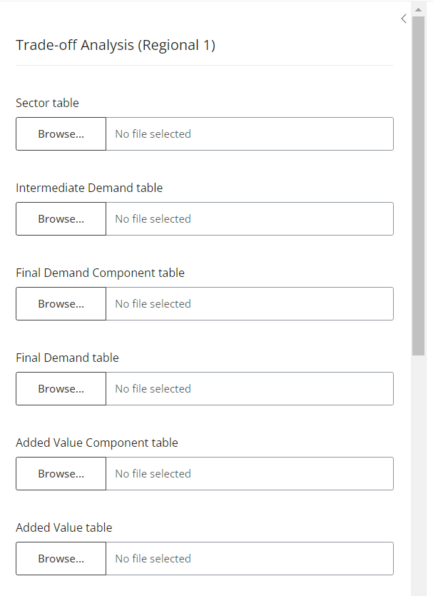
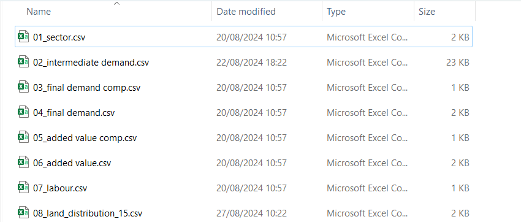
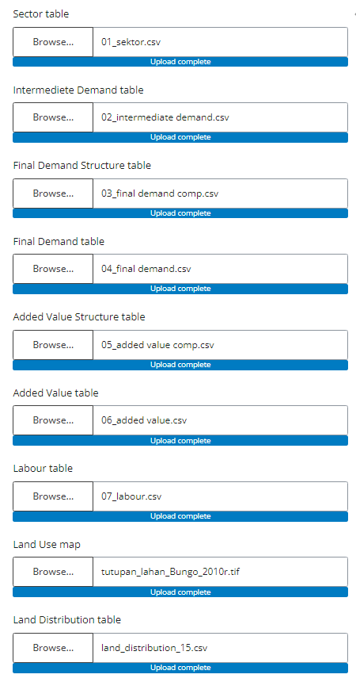

# Regional Economic Descriptive Analysis Module

## Table of Contents

[1. Brief description](#_toc_description)

[2. Data input](#_toc_inputs)

[3. Running the module](#_toc_run)

[4. Outputs](#_toc_outputs)

[5. References](#_toc_refs)

[Annex 1 Complete list of inputs and parameters required by TA Regional 1](#_toc_annex)

------------------------------------------------------------------------

## 1. Brief description

The Regional Economic Descriptive Analysis module calculate the amount of green-house gas emission from land use/cover change using stock difference approach. The stock difference approach estimates GHG emissions or removals from land-use change by calculating the change in carbon stocks over time. This involves comparing the carbon stored in different land-use types at two points in time, using Activity Data that quantifies the extent of land-use change, and Emission Factors that represent the carbon stock changes associated with each land-use transition. By multiplying the Activity Data with the corresponding Emission Factors, we can determine the net GHG emissions or removals resulting from land-use change within a given area and time period.

## 2. Input

## 3. Running the module

### Upload Regional Economy table

Select all related files

### Select working directory

## 4. Outputs 

## 5. References
<!--
## Annex 1 Complete list of inputs and parameters required by the Regional Economic Descriptive Analysis modulle

-->

