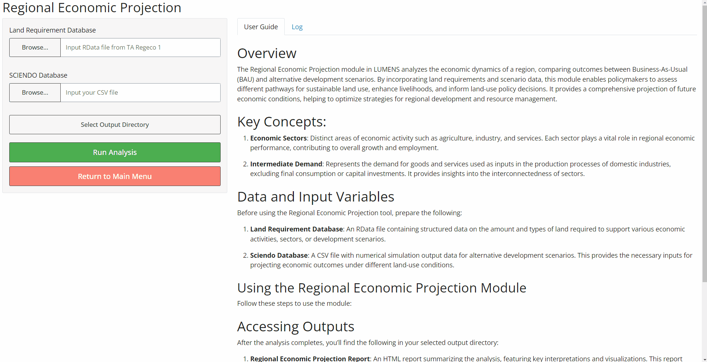

# Overview

The Regional Economic Projection module in LUMENS analyzes the economic dynamics of a region, comparing outcomes between Business-As-Usual (BAU) and alternative development scenarios. By incorporating land requirements and scenario data, this module enables policymakers to assess different pathways for sustainable land use, enhance livelihoods, and inform land-use policy decisions. It provides a comprehensive projection of future economic conditions, helping to optimize strategies for regional development and resource management.

# Key Concepts:

1. **Economic Sectors**: Distinct areas of economic activity such as agriculture, industry, and services. Each sector plays a vital role in regional economic performance, contributing to overall growth and employment.

2. **Intermediate Demand**: Represents the demand for goods and services used as inputs in the production processes of domestic industries, excluding final consumption or capital investments. It provides insights into the interconnectedness of sectors.

# Data and Input Variables

Before using the Regional Economic Projection tool, prepare the following:

1. **Land Requirement Database**: An RData file containing structured data on the amount and types of land required to support various economic activities, sectors, or development scenarios.

2. **Sciendo Database**: A CSV file with numerical simulation output data for alternative development scenarios. This provides the necessary inputs for projecting economic outcomes under different land-use conditions.

## Using the Regional Economic Projection Module

Follow these steps to use the module:

{style="max-width:80%;height=auto;"}

# Accessing Outputs

After the analysis completes, you'll find the following in your selected output directory:

1. **Regional Economic Projection Report**: An HTML report summarizing the analysis, featuring key interpretations and visualizations. This report highlights critical economic indicators and trends, offering insights into the region's economic structure, projected growth, and comparative performance across different development scenarios.

---

For more detailed information or troubleshooting, refer to the full Regional Economic Projection documentation here https://help.lumens.or.id/09-regional2.html or contact the tool developers.

LUMENS is free software and comes with ABSOLUTELY NO WARRANTY. Users are responsible for the results generated. Results depend on the quality of the input data ("garbage in, garbage out") and may vary or be sensitive to the parameters used. Please report any problems encountered while using LUMENS as [a GitHub issue](https://github.com/icraf-indonesia/lumens-shiny/issues). Feedback and questions are welcome [Contact Us URL].